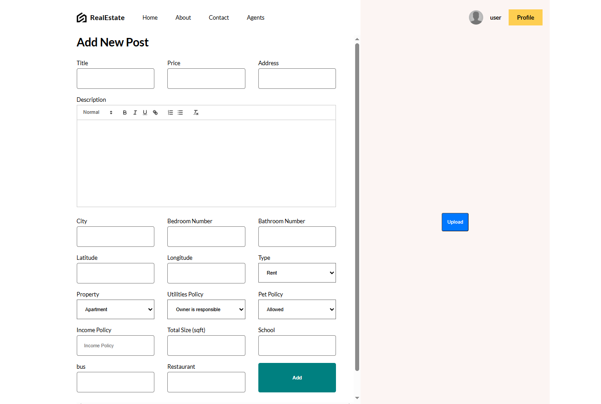
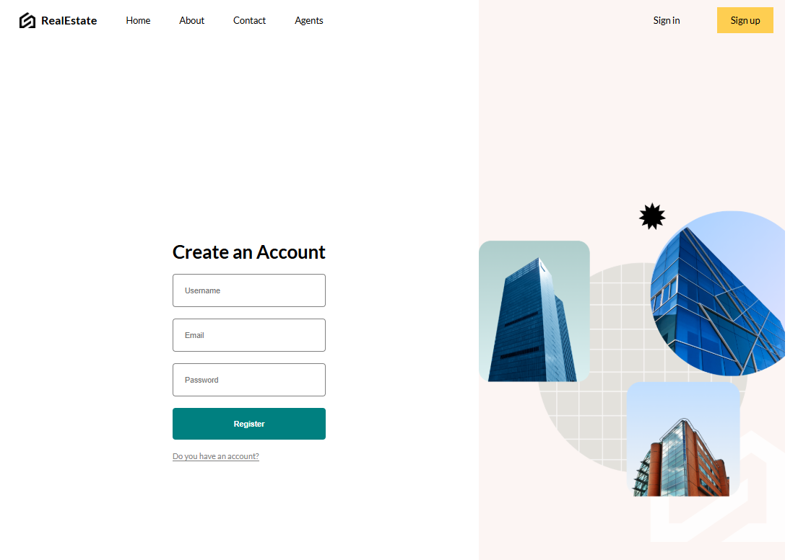

# Full Stack Estate Project

## Overview

Full Stack Estate is a real estate web platform where users can list, search, and save properties for sale or rent. It includes features like interactive map-based search, real-time chat, and secure user authentication. The project is built using modern web technologies to provide a smooth and secure user experience.

**Home Page** 
**Add Post Page** 
**SignUp Page** 

## Features

- **Property Listings**: Users can create, update, and delete property listings with details like price, location, and images.
- **Map-based Search**: Interactive map powered by Leaflet to search properties by location.
- **Real-time Chat**: Direct messaging between buyers and sellers with message history and notifications.
- **Secure Authentication**: User registration and login with JWT, bcrypt, and HTTP-only cookies.
- **Save Properties**: Users can save favorite properties to view later.

## Tech Stack

- **Frontend**: React.js, Vite
- **Backend**: Node.js, Express
- **Database**: MongoDB, Prisma ORM
- **Authentication**: JWT, bcrypt, HTTP-only cookies
- **Map Integration**: Leaflet
- **Other**: CORS, environment variables for security

## Installation

1. **Clone the Repository**:

   ```bash
   git clone https://github.com/your-username/full-stack-estate.git
   cd full-stack-estate
   ```

2. **Install Dependencies**:

   - For backend:

     ```bash
     cd backend
     npm install
     ```
   - For frontend:

     ```bash
     cd frontend
     npm install
     ```

3. **Set Up Environment Variables**:

   - Create a `.env` file in the `backend` folder with:

     ```
     MONGODB_URI=your_mongodb_connection_string
     JWT_SECRET=your_jwt_secret
     PORT=5000
     CLIENT_URL = your_client_url
     ```

4. **Run the Application**:

   - Start the backend:

     ```bash
     cd backend
     npm run dev
     ```
   - Start the frontend:

     ```bash
     cd frontend
     npm run dev
     ```

5. **Access the App**:

   - Open `http://localhost:5173` in your browser.

## Database Structure

The MongoDB database includes the following models:

- **User**: Stores user information (name, email, password).
- **Post**: Stores property listings (title, price, location).
- **PostDetail**: Stores additional property details (description, images).
- **SavedPost**: Tracks user-saved properties.
- **Chat**: Manages chat sessions between users.
- **Message**: Stores chat messages with timestamps.

## Security Features

- Passwords are hashed using bcrypt.
- JWT-based authentication with HTTP-only cookies.
- Protected API routes to prevent unauthorized access.
- Input validation to avoid injection attacks.
- CORS and environment variables for secure configuration.

## Challenges and Solutions

- **Map Integration**: Used Leaflet to handle geolocation and display properties accurately on a map.
- **Real-time Chat**: Implemented WebSockets for instant messaging and stored messages in MongoDB for persistence.
- **Image Uploads**: Optimized image storage by compressing files and using cloud storage.

## Future Improvements

- Add payment integration for premium listings.
- Optimize search with indexing and filters.
- Implement property verification for trusted listings.
- Improve mobile responsiveness.

## How to Contribute

1. Fork the repository.
2. Create a new branch (`git checkout -b feature-name`).
3. Make changes and commit (`git commit -m "Add feature"`).
4. Push to the branch (`git push origin feature-name`).
5. Create a pull request.

## Contact

For questions or feedback, reach out at \[jahirmj@gmail.com\].
